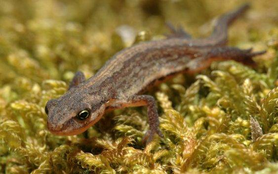

# Strona o Traszce Zwyczajnej


## Wstęp

Projekt ma na celu dostarczenie informacji na temat Traszki Zwyczajnej, gatunku płaza występującego w Polsce, oraz umożliwienie dostępu do tych treści poprzez skanowanie kodu QR.

## Rozdziały

1. **Opis**: Charakteryzacja Traszki Zwyczajnej.

2. **Życie w wodzie**: Informacje na temat środowiska i zachowań Traszki Zwyczajnej w wodzie.

3. **Rozmnażanie**: Cykl rozwoju i rozrodu Traszki Zwyczajnej.

4. **Występowanie w Polsce**: Rozpowszechnienie gatunku w Polsce.

5. **Zagrożenia**: Czynniki zagrażające populacjom Traszki Zwyczajnej.

6. **Zmiana rozszerzenia obrazka**: Krótka dygresja o dostosowaniu rozszerzeń na różnych systemach.

## Krótka dygresja: Zmiana rozszerzenia obrazka 

Czasami przy przeglądaniu strony, fotografia może nie wyświetlać się poprawnie. 
Jest to czysto zależne od systemu operacyjnego na którym postawiona została strona.
Oto krótka wskazówka, która pozwoli Ci dostosować rozszerzenie obrazka w zależności od systemu operacyjnego:

- **Windows**: Aby obrazek wyświetlał się poprawnie na systemie Windows, w sekcji `<body> ` zmień rozszerzenie na `.jpg`.
```html

```
- **MacOS**: Jeśli korzystasz z macOS, w sekcji `<body> `  warto użyć rozszerzenia `.jpeg`. System ten preferuje to rozszerzenie, zamiast `.jpg`.
```html

```

## Kontakt

W przypadku pytań, uwag lub sugestii, prosimy o kontakt pod adresem e-mail: [strach.daniel.dev@gmail.com](mailto:strach.daniel.dev@gmail.com).

## Uwaga

Strona została stworzona z myślą o skanowaniu kodu QR. Licencja strony jest zawarta w stopce.
Fotografia użyta na stronie jest licencjonowana na mocy Creative Commons Attribution 2.0 Generic (CC BY 2.0).

---
